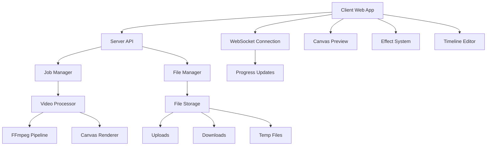

# Design Document

## Overview

The Karaoke Video Renderer is a web-based application built using vanilla JavaScript for the client and Node.js for the server. The application follows a hybrid architecture where the client handles real-time preview and effect editing using HTML5 Canvas, while the server performs memory-optimized video processing using FFmpeg and node-canvas. This design ensures consistent rendering between preview and final output while eliminating browser memory limitations.

The architecture is designed around modular rendering engines, clear separation between client and server responsibilities, and file-based streaming to handle videos of any length. The application maintains real-time responsiveness through optimized Canvas rendering and provides professional-quality output through server-side FFmpeg processing.

## Architecture

### High-Level Architecture



### Core Architectural Principles

1. **Client-Server Separation**: Browser handles preview and editing, server handles production rendering
2. **Memory Streaming**: File-based processing prevents memory issues with long videos
3. **Modular Renderers**: Multiple rendering engines for different performance needs
4. **Real-time Communication**: WebSocket for live progress updates
5. **Automatic Cleanup**: Managed file lifecycle with automatic cleanup policies

## Components and Interfaces

### 1. Client-Side Components

**KaraokeApp Class (app.js)**

- Manages overall application state and component coordination
- Handles video playback, timeline management, and effect application
- Coordinates between preview rendering and server communication

**ServerRenderer Class (src/client/ServerRenderer.js)**

```javascript
class ServerRenderer {
    async uploadVideo(videoFile)
    async startRenderJob(videoId, subtitles, wordSegments, effects, renderSettings)
    async getJobStatus(jobId)
    async cancelJob(jobId)
    connectWebSocket(jobId, onProgress)
}
```

**Rendering Engines (src/core/)**

- **MemoryOptimizedRenderer**: Streaming frame processing for memory efficiency
- **ParallelRenderer**: Multi-threaded processing for performance
- **GPURenderer**: Hardware-accelerated rendering when available
- **BatchProcessor**: Batch frame processing utilities

### 2. Server-Side Components

**Express Server (server/server.js)**

- REST API endpoints for file upload, job management, and downloads
- WebSocket server for real-time progress updates
- Static file serving and CORS configuration

**VideoProcessor Class (server/src/core/VideoProcessor.js)**

```javascript
class VideoProcessor {
    async processVideo(jobData)
    async extractFrames(videoPath, outputDir, startFrame, endFrame)
    async renderKaraokeFrame(framePath, subtitleData, effects, outputPath)
    async assembleVideo(framesDir, audioPath, outputPath, settings)
}
```

**RenderJobManager Class (server/src/core/RenderJobManager.js)**

```javascript
class RenderJobManager {
    createJob(jobData)
    queueJob(jobId)
    processNextJob()
    updateJobStatus(jobId, status, progress)
    cancelJob(jobId)
    cleanupJob(jobId)
}
```

**FileManager Class (server/src/core/FileManager.js)**

```javascript
class FileManager {
    saveUploadedFile(file, directory)
    createTempDirectory(jobId)
    cleanupTempFiles(maxAge)
    cleanupDownloads(maxAge)
    getFileMetadata(filePath)
}
```

### 3. Effect System

**Effect Base Interface**

```javascript
class Effect {
    constructor(name, parameters)
    apply(canvas, context, subtitleData, currentTime)
    preview(canvas, context, subtitleData, currentTime)
    getParameters()
    validateParameters(params)
}
```

**Effect Categories:**

- **Text Styling**: Font, color, positioning, background, borders, shadows
- **Karaoke Effects**: Word highlighting, character-by-character progression
- **Animation**: Fade in/out, scale bounce, typewriter, slide transitions
- **Visual Enhancements**: Glow effects, particle systems, background animations

## Data Models

### Client-Side Models

```javascript
// Subtitle Data Structure
const subtitleData = {
  lines: [
    {
      start_time: 0.0,
      end_time: 3.5,
      text: "Hello world",
      words: [
        { word: "Hello", start_time: 0.0, end_time: 1.5 },
        { word: "world", start_time: 1.5, end_time: 3.5 },
      ],
    },
  ],
};

// Effect Configuration
const effectConfig = {
  fontFamily: "Arial",
  fontSize: 60,
  primaryColor: "#ffffff",
  highlightColor: "#ffff00",
  karaokeMode: "highlight",
  enableBorder: true,
  borderWidth: 2,
  borderColor: "#000000",
  position: { x: 960, y: 930 },
  animations: ["fadeIn", "scaleBouce"],
};

// Render Settings
const renderSettings = {
  resolution: "1080p",
  frameRate: 30,
  quality: "high",
  format: "mp4",
  renderMode: "ultra-fast",
};
```

### Server-Side Models

```javascript
// Job Data Structure
const jobData = {
  jobId: "uuid-string",
  videoId: "uploaded-video-id",
  status: "queued|processing|completed|failed|cancelled",
  progress: 0,
  message: "Processing frame 1247/9000",
  createdAt: "2024-01-15T10:30:00.000Z",
  completedAt: null,
  downloadUrl: null,
  subtitles: subtitleData,
  effects: effectConfig,
  renderSettings: renderSettings,
};

// File Metadata
const fileMetadata = {
  filename: "video.mp4",
  size: 104857600,
  duration: 180.5,
  resolution: { width: 1920, height: 1080 },
  frameRate: 30,
  hasAudio: true,
  format: "mp4",
};
```

## Processing Pipeline

### Client Preview Pipeline

1. **Video Loading**: HTML5 Video element loads and provides frame data
2. **Canvas Rendering**: Real-time effect application using Canvas 2D API
3. **Timeline Synchronization**: Subtitle timing synchronized with video playback
4. **Effect Preview**: Instant effect updates without server communication

### Server Rendering Pipeline

1. **Job Creation**: Client uploads video and creates render job
2. **Frame Extraction**: FFmpeg extracts video frames in batches of 100
3. **Karaoke Rendering**: Node-canvas applies effects to each frame
4. **Video Assembly**: FFmpeg combines processed frames with original audio
5. **File Delivery**: Completed video available for download with automatic cleanup

### Memory Management Strategy

```javascript
// Batch Processing Example
for (let batch = 0; batch < totalBatches; batch++) {
  // Extract frames to disk (not memory)
  await extractFrameBatch(videoPath, batchDir, batch * 100, (batch + 1) * 100);

  // Process each frame individually
  const frameFiles = await fs.readdir(batchDir);
  for (const frameFile of frameFiles) {
    await renderKaraokeFrame(path.join(batchDir, frameFile), effects);
    // Frame is processed and immediately available for cleanup
  }

  // Clean up batch immediately
  await fs.remove(batchDir);

  // Update progress
  updateProgress(jobId, ((batch + 1) / totalBatches) * 100);
}
```

## Error Handling

### Error Categories

1. **Client-Side Errors**

   - Canvas rendering failures
   - Video loading errors
   - WebSocket connection issues
   - File upload failures

2. **Server-Side Errors**

   - FFmpeg processing errors
   - File system errors (disk space, permissions)
   - Job queue failures
   - Memory/resource limitations

3. **Network Errors**
   - Upload timeouts
   - WebSocket disconnections
   - API request failures
   - Download interruptions

### Error Handling Strategy

```javascript
class ErrorHandler {
  handleClientError(error, context) {
    // Log error and show user-friendly message
    console.error(`Client error in ${context}:`, error);
    this.showUserMessage(this.getErrorMessage(error), "error");
  }

  handleServerError(error, jobId) {
    // Update job status and notify client
    this.updateJobStatus(jobId, "failed", 0, error.message);
    this.cleanupFailedJob(jobId);
  }

  handleNetworkError(error, operation) {
    // Implement retry logic with exponential backoff
    return this.retryWithBackoff(operation, 3, 1000);
  }
}
```

## Performance Optimization

### Client-Side Optimizations

- **Canvas Optimization**: Efficient drawing operations and layer management
- **Frame Caching**: Cache rendered frames for smooth timeline scrubbing
- **Debounced Updates**: Prevent excessive re-rendering during parameter changes
- **Web Workers**: Offload heavy computations from main thread

### Server-Side Optimizations

- **Concurrent Processing**: Up to 3 simultaneous render jobs
- **Hardware Acceleration**: FFmpeg hardware encoding when available
- **File Streaming**: Process frames without loading entire video into memory
- **Automatic Cleanup**: Aggressive cleanup of temporary files

### Memory Management

- **Client**: Maximum 50 frames in memory for preview
- **Server**: Maximum 100 frames in memory per batch
- **Cleanup Policies**:
  - Temporary files: 1 hour
  - Downloads: 24 hours
  - Failed jobs: Immediate cleanup

## Testing Strategy

### Unit Testing

**Client-Side Testing:**

- Canvas rendering accuracy
- Effect parameter validation
- Timeline synchronization
- WebSocket communication

**Server-Side Testing:**

- Video processing pipeline
- Job management lifecycle
- File operations and cleanup
- API endpoint functionality

### Integration Testing

**End-to-End Workflows:**

- Complete video upload to download process
- Real-time progress updates via WebSocket
- Error handling and recovery scenarios
- Concurrent job processing

### Performance Testing

**Load Testing:**

- Multiple concurrent uploads and renders
- Large video file processing (2+ hours)
- Memory usage monitoring under load
- WebSocket connection stability

**Benchmark Testing:**

- Rendering speed across different video lengths
- Memory usage patterns during processing
- Client preview performance with complex effects
- Server resource utilization optimization
