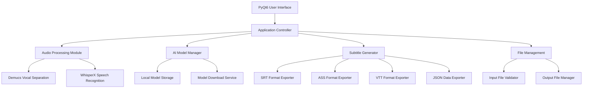

# Design Document

## Overview

The Lyric-to-Subtitle App is designed as a desktop application using Python with PyQt6 for the user interface. The application follows a modular architecture that separates concerns between audio processing, AI model management, subtitle generation, and user interface components. The design emphasizes offline operation, progress tracking, and extensibility for future enhancements.

## Architecture

### High-Level Architecture



### Core Components

1. **Application Controller**: Central orchestrator managing workflow and component coordination
2. **Audio Processing Module**: Handles vocal separation and speech recognition pipeline
3. **AI Model Manager**: Manages model downloads, caching, and lifecycle
4. **Subtitle Generator**: Converts alignment data to various subtitle formats
5. **File Management**: Handles input validation and output file operations
6. **User Interface**: PyQt6-based desktop interface with progress tracking

## Components and Interfaces

### Application Controller

**Purpose**: Central coordination of all application operations and workflow management.

**Key Responsibilities**:

- Orchestrate the complete audio-to-subtitle pipeline
- Manage application state and user session data
- Coordinate between UI events and backend processing
- Handle error propagation and recovery

**Interface**:

```python
class ApplicationController:
    def process_audio_file(self, file_path: str, options: ProcessingOptions) -> ProcessingResult
    def process_batch(self, file_paths: List[str], options: ProcessingOptions) -> BatchResult
    def get_processing_status(self) -> ProcessingStatus
    def cancel_processing(self) -> bool
```

### Audio Processing Module

**Purpose**: Manages the AI-powered audio processing pipeline including vocal separation and speech recognition.

**Key Responsibilities**:

- Execute Demucs vocal separation with progress tracking
- Run WhisperX transcription and forced alignment
- Handle model selection and configuration
- Manage temporary audio files and cleanup

**Interface**:

```python
class AudioProcessor:
    def separate_vocals(self, audio_path: str, model_size: str) -> VocalSeparationResult
    def transcribe_with_alignment(self, vocals_path: str, model_size: str) -> TranscriptionResult
    def set_progress_callback(self, callback: Callable[[float, str], None])
```

### AI Model Manager

**Purpose**: Handles downloading, caching, and management of AI models (Demucs and WhisperX).

**Key Responsibilities**:

- Check for locally available models
- Download missing models with progress tracking
- Manage model storage and versioning
- Validate model integrity

**Interface**:

```python
class ModelManager:
    def check_model_availability(self, model_type: str, model_size: str) -> bool
    def download_model(self, model_type: str, model_size: str) -> DownloadResult
    def get_model_path(self, model_type: str, model_size: str) -> str
    def list_available_models(self) -> Dict[str, List[str]]
```

### Subtitle Generator

**Purpose**: Converts transcription and alignment data into various subtitle formats.

**Key Responsibilities**:

- Generate SRT files (sentence and word-level)
- Create ASS files with karaoke styling
- Export VTT format for web compatibility
- Produce JSON alignment data for advanced use

**Interface**:

```python
class SubtitleGenerator:
    def generate_srt(self, alignment_data: AlignmentData, word_level: bool) -> str
    def generate_ass_karaoke(self, alignment_data: AlignmentData, style_options: ASSStyle) -> str
    def generate_vtt(self, alignment_data: AlignmentData) -> str
    def export_json_alignment(self, alignment_data: AlignmentData) -> str
```

### Translation Service

**Purpose**: Provides optional translation capabilities for bilingual subtitle generation.

**Key Responsibilities**:

- Integrate with DeepL and Google Translate APIs
- Handle translation errors and fallbacks
- Manage API rate limiting and authentication
- Generate bilingual subtitle formats

**Interface**:

```python
class TranslationService:
    def translate_text(self, text: str, target_language: str, service: str) -> TranslationResult
    def is_service_available(self, service: str) -> bool
    def generate_bilingual_subtitles(self, alignment_data: AlignmentData, target_lang: str) -> BilingualSubtitles
```

## Data Models

### Core Data Structures

```python
@dataclass
class ProcessingOptions:
    model_size: str  # tiny, base, small, medium, large
    export_formats: List[str]  # srt, ass, vtt, json
    word_level_srt: bool
    karaoke_mode: bool
    translation_enabled: bool
    target_language: Optional[str]
    output_directory: str

@dataclass
class AlignmentData:
    segments: List[Segment]
    word_segments: List[WordSegment]
    confidence_scores: List[float]
    audio_duration: float

@dataclass
class Segment:
    start_time: float
    end_time: float
    text: str
    confidence: float

@dataclass
class WordSegment:
    word: str
    start_time: float
    end_time: float
    confidence: float
    segment_id: int

@dataclass
class ProcessingResult:
    success: bool
    output_files: List[str]
    processing_time: float
    error_message: Optional[str]
    alignment_data: Optional[AlignmentData]
```

### File Management

```python
@dataclass
class AudioFile:
    path: str
    format: str
    duration: float
    sample_rate: int
    channels: int

@dataclass
class SubtitleFile:
    path: str
    format: str
    content: str
    word_count: int
    duration: float
```

## Error Handling

### Error Categories

1. **Input Validation Errors**

   - Unsupported file formats
   - Corrupted audio files
   - Invalid file paths

2. **Model Errors**

   - Missing models
   - Model download failures
   - Insufficient system resources

3. **Processing Errors**

   - Vocal separation failures
   - Speech recognition errors
   - Low confidence transcriptions

4. **Export Errors**
   - File write permissions
   - Disk space issues
   - Invalid output paths

### Error Handling Strategy

```python
class ErrorHandler:
    def handle_processing_error(self, error: ProcessingError) -> ErrorResponse
    def log_error(self, error: Exception, context: str)
    def get_user_friendly_message(self, error: Exception) -> str
    def suggest_recovery_actions(self, error: Exception) -> List[str]
```

### Recovery Mechanisms

- Automatic retry for transient failures
- Graceful degradation for optional features
- User-guided recovery for critical errors
- Detailed error logging for debugging

## Testing Strategy

### Unit Testing

**Audio Processing Tests**:

- Mock Demucs and WhisperX models for isolated testing
- Test audio file validation and format support
- Verify progress callback functionality
- Test error handling for various failure scenarios

**Subtitle Generation Tests**:

- Test all export formats with known alignment data
- Verify timing accuracy and format compliance
- Test karaoke styling and word-level synchronization
- Validate bilingual subtitle generation

**Model Management Tests**:

- Test model availability checking
- Mock download processes and progress tracking
- Test model path resolution and caching
- Verify integrity checking mechanisms

### Integration Testing

**End-to-End Pipeline Tests**:

- Test complete audio-to-subtitle workflow
- Verify file input/output operations
- Test batch processing functionality
- Validate cross-component error propagation

**UI Integration Tests**:

- Test user workflow scenarios
- Verify progress indicator accuracy
- Test error message display and user guidance
- Validate file selection and export dialogs

### Performance Testing

**Processing Performance**:

- Benchmark vocal separation times across model sizes
- Test memory usage during batch processing
- Verify cleanup of temporary files
- Test concurrent processing limitations

**Model Loading Performance**:

- Benchmark model initialization times
- Test memory usage for different model sizes
- Verify model caching effectiveness

### User Acceptance Testing

**Workflow Testing**:

- Test typical user scenarios with real audio files
- Verify subtitle quality and synchronization accuracy
- Test error recovery and user guidance
- Validate export format compatibility with common tools

## Implementation Considerations

### Technology Stack

- **Python 3.9+**: Core language with async/await support
- **PyQt6**: Modern desktop UI framework with native look and feel
- **Demucs**: State-of-the-art vocal separation (Facebook Research)
- **WhisperX**: Enhanced Whisper with forced alignment capabilities
- **PyTorch**: Deep learning framework for model execution
- **librosa**: Audio processing and analysis
- **pydub**: Audio format conversion and manipulation

### Model Management

- Models stored in user's application data directory
- Automatic model downloading with progress tracking
- Model versioning and update mechanisms
- Configurable model storage locations

### Performance Optimization

- Lazy model loading to reduce startup time
- Efficient memory management for large audio files
- Progress streaming for long-running operations
- Configurable processing quality vs. speed trade-offs

### Cross-Platform Considerations

- PyInstaller for creating standalone executables
- Platform-specific file dialog integration
- Native progress indicators and notifications
- Proper handling of file path separators and permissions

### Security Considerations

- Input validation for all file operations
- Safe handling of temporary files with proper cleanup
- Secure API key management for translation services
- Protection against path traversal attacks in file operations
